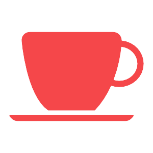

    
    <h1>Foodz - Project Thema 4</h1>
    
A small website builded for student at Koning Willem I College (not for use purposes) where students can add, edit and delete catering events

    <a href="https://kw1c-schuurmansmark.github.io/ProjectThema4/">View Demo</a>
    ·
    <a href="https://github.com/kw1c-SchuurmansMark/ProjectThema4/issues">Report Bug</a>
    ·
    <a href="https://github.com/kw1c-SchuurmansMark/ProjectThema4/issues">Request Feature</a>

      

